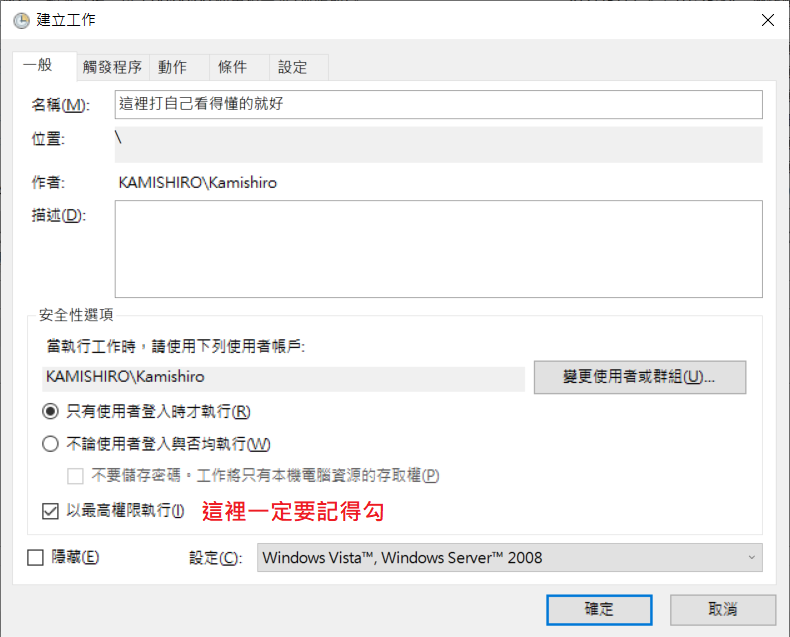
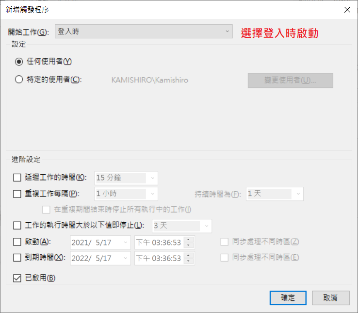
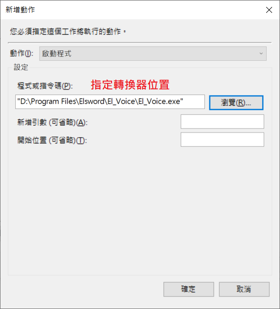
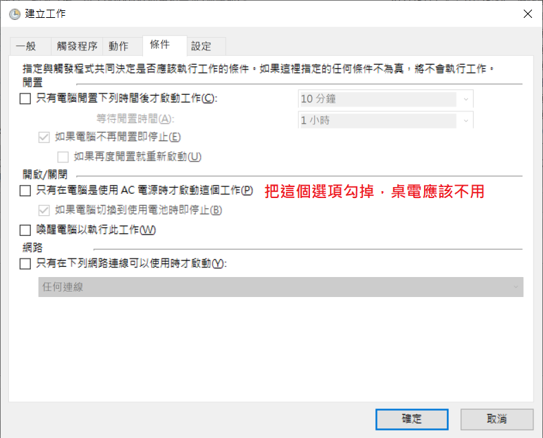
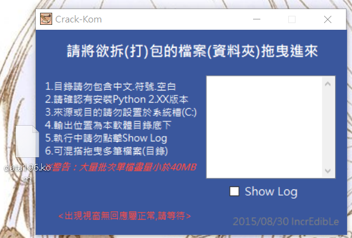
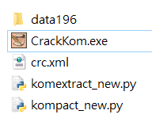
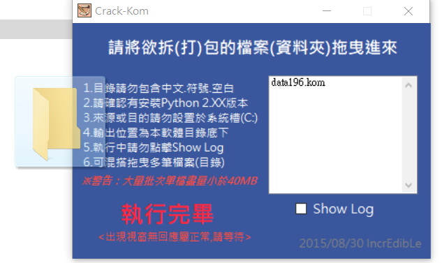

# ElswordVoice_Remake

## 原版項目
原版項目請參考：[ElswordVoice](https://github.com/explooosion/ElswordVoice/tree/master)

 

## 修改版特點
此修改版與原版的主要差異：
- 開啟後不會檢查更新
- 開啟後會直接縮小化，並移除小 EVE 介面
- 不需點擊圖片，開啟後便會直接偵測遊戲是否運行
- 遊戲關閉後會自動復原檔案，防止更新時重新下載
- 移除 Elsword 字樣，防止遊戲偵測

 

## 下載
- 程式本體：[El_Voice](https://github.com/wonk2563/ElswordVoice_Remake/releases/download/Release/El_Voice.zip)
- 字體檔：[自製方正粗圓體 + 台北黑體混合](https://github.com/wonk2563/ElswordVoice_Remake/releases/download/Release/data196.kom)
- 拆包軟體：[CrackKom](https://ta7382.pixnet.net/blog/post/203158321)

 

## 使用方法

### 基本安裝
1. 將 El_Voice 資料夾拖放到遊戲目錄 (Elsword64) 下
2. 將字體檔 (data196.kom) 放入 El_Voice/data 資料夾
3. 使用【管理員權限】開啟 El_Voice.exe
4. 開啟後程式會在右下角以小圖示待機
5. 開啟遊戲，進入遊戲後字體便會轉換完成

 

### 開機自動啟動設定
1. 開啟 Windows 內建的工作排程器
2. 點擊右方的「建立工作」
3. 依照以下步驟設定排程，即可實現開機自動啟動

 

### 自訂字體方法
1. 安裝 Python 2.7
2. 使用 CrackKom.exe 開啟字體檔 (將 data196.kom 拖入)

 

 

3. 拆出的資料會在程式目錄下的 data196 資料夾

 

 

4. 將想使用的字體檔名改為：
   - DFT_P7.ttC
   - DFT_P7U.TTF
5. 放入覆蓋原有檔案
6. 將 data196 資料夾拖移進程式中，新的字體檔會產生在目錄下

 

 

## 授權
本項目基於 MIT 授權條款